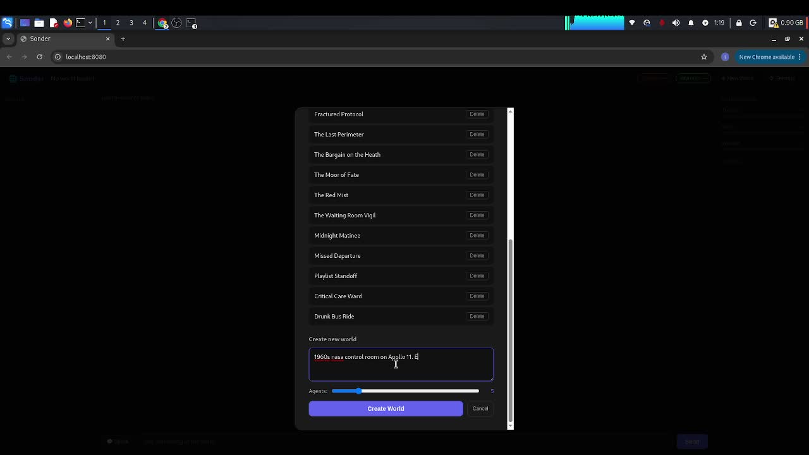

# Sonder

> *sonder* — the realization that each passerby has a life as vivid and complex as your own.

**Created by [Redson Ngwira](https://github.com/RedsonNgwira) · [@RedsonNgwira](https://twitter.com/RedsonNgwira) · Malawi 🇲🇼**

**Run AI social simulations for free, forever. No credit card. No API costs.**

Sonder is a self-hosted social simulation engine. You describe a scene. AI agents with distinct personalities, histories, and grievances spawn inside it and start talking to each other — without you saying a word.

You can watch. You can whisper to someone. You can stay silent and see what happens.

---

> ⚠️ **Responsible use** — Sonder can simulate real people, including public figures. You are responsible for how you use it. Do not share simulations of real people publicly without their consent.

---

## What it looks like

[](https://youtu.be/bamGEDhv1Mk)


You type: *"Five coworkers watching football at someone's flat. The team is losing. One of them hasn't been paid in three weeks."*

Sonder generates five people. Gives each of them a reason to be there, a thing that's eating at them, a way of talking. Then it starts the room.

Dan starts a passive-aggressive argument about a coaster. Mike explodes about the tactics. Chloe takes a dig and can't help herself. Jess plays peacekeeper, flinching. Steve sits back and watches it all burn.

Nobody is being helpful. Nobody is behaving the same way. They're being human.

---

## Features

- **Autonomous simulation** — agents talk to each other without any input from you
- **Distinct personalities** — each agent has a background, a grievance, a speaking style, and emotional state that shifts in real time
- **Behavioral research** — world creation pulls real psychology research (DuckDuckGo) to ground agent behavior
- **Hot-reload** — edit any agent's `.md` file on disk and changes take effect on the next tick, no restart needed
- **Whisper system** — send private messages to individual agents mid-scene
- **Atmosphere tracking** — tension, noise, and warmth evolve as the scene unfolds
- **Narrator mode** — click 🎭 to step outside the scene and ask an omniscient narrator anything: *"what is Steve thinking but not saying"*, *"who has the most power in this room"*, *"what would happen if I told everyone about the debt"*. The narrator has full access to every agent's backstory, relationships, and internal state — and remembers what it's already told you

> *"closer to a playwright's relationship with their characters than a user's relationship with a chatbot"*
> — [Jeffrin-dev](https://news.ycombinator.com/item?id=47420182), Hacker News
- **Free to run** — works with Qwen OAuth (no API key, free), Groq, Gemini free tier, OpenRouter free models, or any local Ollama model
- **Voice** — click 🔊 on any message to hear it read aloud via browser TTS (free, no setup). Realistic voice plugins (ElevenLabs, Coqui, Piper) documented in [`plugins/PLUGINS.md`](plugins/PLUGINS.md)

---

## Quickstart

Runs on Linux, macOS, and Android (Termux, Android 7+).

```bash
git clone https://github.com/RedsonNgwira/sonder
cd sonder
python -m venv venv && source venv/bin/activate
pip install -r requirements.txt
python onboard.py   # pick a provider, authenticate
python main.py      # open http://localhost:8080
```

### Providers

For the best experience — fastest responses, free, no credit card — use **Cerebras** or **Groq**. Both return responses in under a second.

**Free forever**

| Provider | Free allowance | Speed | Setup |
|----------|---------------|-------|-------|
| **Cerebras** | 1M tokens/day | ⚡ Fastest available | API key — [cloud.cerebras.ai](https://cloud.cerebras.ai) |
| **Groq** | ~500K tokens/day | ⚡ Very fast | API key — [console.groq.com](https://console.groq.com/keys) |
| Gemini Flash | 1M tokens/day | Fast | API key — [aistudio.google.com](https://aistudio.google.com/apikey) |
| OpenRouter | Free models available | Varies | API key — [openrouter.ai](https://openrouter.ai/keys) |
| Qwen | Unlimited (OAuth) | Moderate | OAuth login, no key needed |
| Ollama | Unlimited, local | Depends on hardware | No key — runs on your machine |

**Pay if you want more** — every major provider is supported:

| Provider | Models | Setup |
|----------|--------|-------|
| Anthropic | Claude Sonnet, Opus | [console.anthropic.com](https://console.anthropic.com/keys) |
| OpenAI | GPT-4o, o1 | [platform.openai.com](https://platform.openai.com/api-keys) |
| Mistral | Mistral Large | [console.mistral.ai](https://console.mistral.ai/api-keys) |
| xAI | Grok | [console.x.ai](https://console.x.ai) |
| Together AI | Llama, Mixtral | [api.together.xyz](https://api.together.xyz/settings/api-keys) |
| Any OpenAI-compatible API | LM Studio, vLLM, etc. | Custom base URL |

---

## How agents work

Each agent lives in a `.md` file at `worlds/{scene}/agents/{name}.md`:

```markdown
# Mike

## Identity
- Age: 34
- Background: Sales manager, hasn't hit quota in two months, blames the product

## Personality
- Traits: defensive, loud, loyal
- Speaking style: loud and defensive
- Current grievance: team is losing and nobody else seems to care

## Behavioral Research
- (DuckDuckGo snippets about stress displacement, in-group frustration...)

## Relationships
- Dan: trust=40, hostility=60, affection=30

## Emotional State
- Anger: 75
- Sadness: 30
- Happiness: 15
- Social willingness: 45

## Behavioral Notes
<!-- Edit freely. Changes take effect on next simulation tick. -->
```

Edit any field. Save the file. The simulation picks it up on the next tick.

---

## Architecture

```
main.py              FastAPI + WebSocket server
onboard.py           Setup wizard (provider auth, model selection)
config.py            Config singleton, provider detection
providers/
  llm.py             LiteLLM wrapper (all providers)
  oauth.py           Device-code OAuth with PKCE (Qwen)
simulation/
  world_builder.py   Scene → agents (LLM + research)
  researcher.py      DuckDuckGo → behavioral research summary
  agent_loader.py    Read/write/hot-reload agent .md files
  agent.py           AgentRunner — builds prompts, runs turns
  loop.py            Autonomous simulation loop
db/models.py         Pydantic models (Agent, World, MoodState)
static/index.html    Three-panel UI
```

---

## Self-hosted

No cloud. No accounts. No data leaves your machine (unless you use a cloud provider for inference — your choice).

Worlds are stored as plain `.md` files in `worlds/`. Human-readable, version-controllable, editable in any text editor.

---

## Community

Discord server coming soon — [star the repo](https://github.com/RedsonNgwira/sonder) to get notified.

---

## License

GPL-3.0 — see [LICENSE](LICENSE). If you build on Sonder, keep the attribution. See [CITATION.md](CITATION.md).
